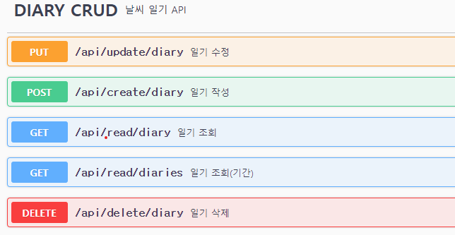

# 🙌 날씨 일기 프로젝트

#### 외부 API를 이용해서 날씨 데이터를 가져와 일기를 작성하는 API 입니다.

---
## 🛠 기술 스택
- JAVA 17
- SPRING BOOT 3.2.10
- SPRING BOOT DATA JPA
- SWAGGER
- MYSQL
- GIT
---
## 🙋‍♀️ 기능
- 일기 CRUD
- 외부 API를 이용해서 날씨 데이터 가져오기
- 가져온 날씨 데이터를 매일 새벽 1시마다 DB에 저장하기
- logback을 이용한 로그 기록 남기기
- swagger을 이용한 API 문서 작성
---
## 🙋‍♀️ API 명세서
